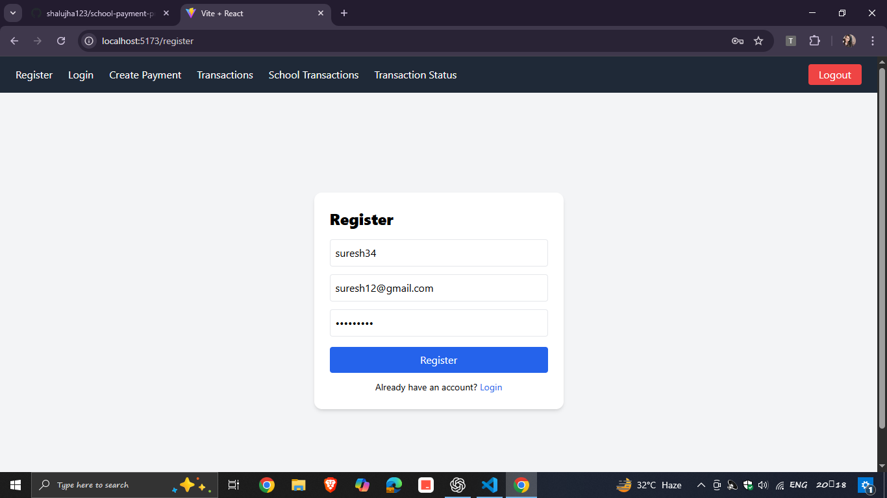
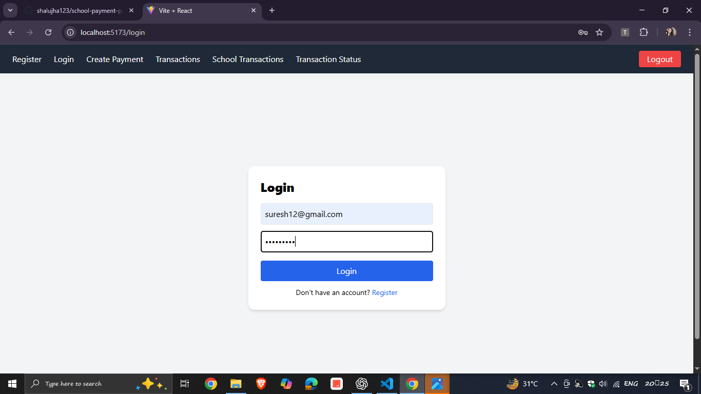
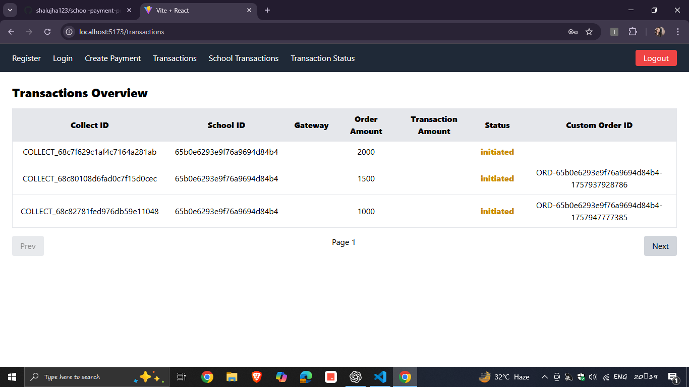
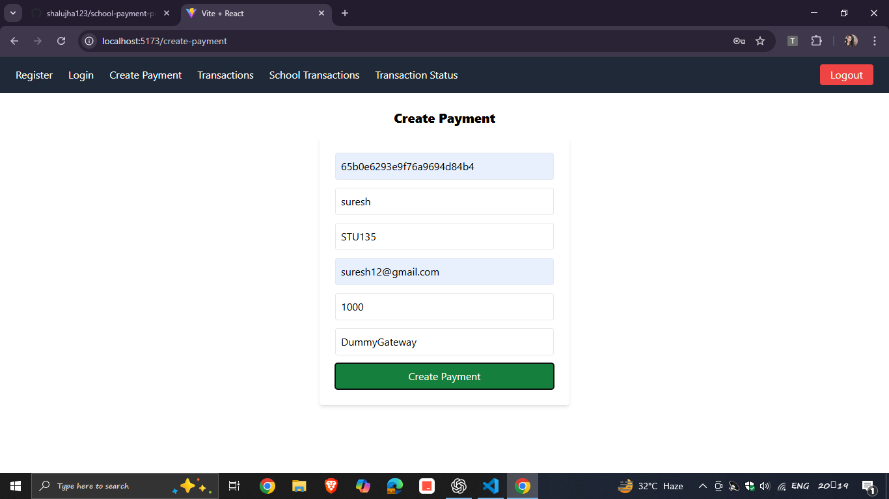
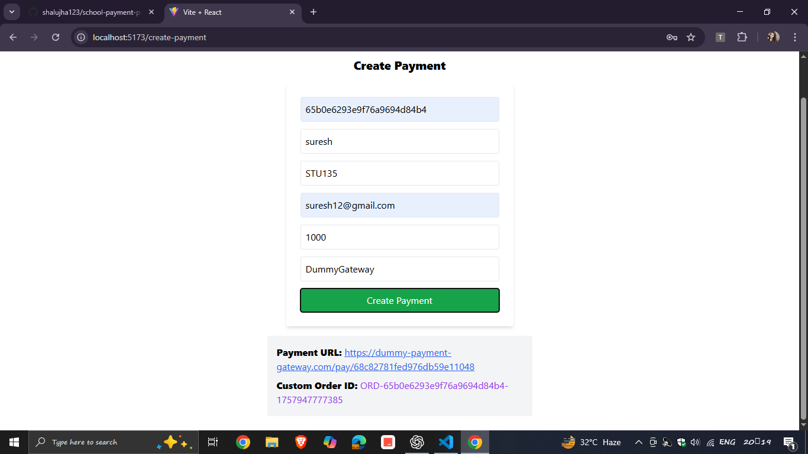
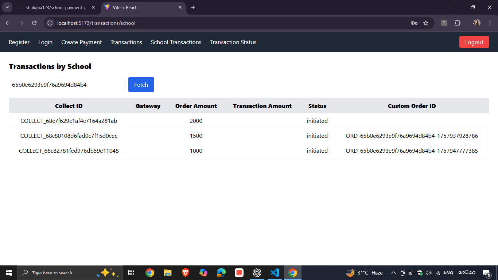
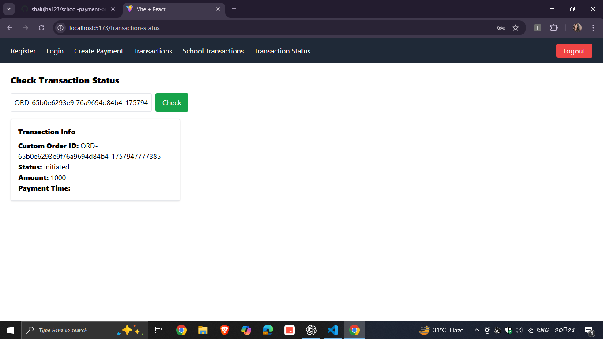

School Payment & Dashboard Application
Overview

This project is a full-stack MERN application for managing school payments and transaction dashboards.

It includes:

Secure JWT Authentication (Register/Login)

Payment flow with dummy gateway integration

Webhook support (updates transaction status)

Transactions Dashboard with filters, pagination, and sorting

Frontend UI built using React + TailwindCSS

Tech Stack

Backend: Node.js, Express.js, MongoDB, Mongoose, JWT, Axios

Frontend: React.js, Vite, TailwindCSS, Axios, React Router

Database: MongoDB Atlas

Project Setup

1. Clone Repo
   git clone https://github.com/shalujha123/school-payment-project.git
   cd school-payment-project

2. Backend Setup
   cd backend # or root, if backend files are directly in root
   npm install

Create a .env file inside backend folder:

PORT=5000
MONGO_URI=mongodb+srv://<user>:<password>@cluster.mongodb.net/schoolpay?retryWrites=true&w=majority
JWT_SECRET=your-secret
JWT_EXPIRES_IN=1h
SCHOOL_ID=65b0e6293e9f76a9694d84b4

FRONTEND_RETURN_URL=http://localhost:5173/payment-callback

Run backend:

npm run dev

3. Frontend Setup
   cd frontend
   npm install

Create a .env file inside frontend folder:

VITE_API_BASE_URL=http://localhost:5000/api

Run frontend:

npm run dev

Now open:
Frontend → http://localhost:5173
Backend → http://localhost:5000/api

API Endpoints
Auth

POST /register → Register user

POST /login → Login user, returns JWT

Payments

POST /create-payment (protected) → Create new payment

POST /webhook → Payment gateway callback

Transactions

GET /transactions (protected) → All transactions (pagination, sorting, filters)

GET /transactions/school/:schoolId (protected) → Transactions for a school

GET /transaction-status/:custom_order_id (protected) → Status of one transaction

Frontend Pages

Register → User registration

Login → Login & save JWT

Transactions Overview → Show all transactions (with filters/sorting)

School Transactions → Transactions for a specific school

Transaction Status → Check status of one transaction

Create Payment → Initiate a payment

Features

JWT auth for secure APIs

MongoDB aggregation pipeline for reports

Dummy payment gateway integration

Webhook for transaction updates

TailwindCSS responsive UI

Pagination, sorting & filtering

Navbar with Logout

Deployment

Backend: Render / Heroku / AWS
Frontend: Netlify / Vercel
Database: MongoDB Atlas

Screenshots

### Register Page

### Login Page

### Transactions Overview

### Create Payment

### Transaction School

### Transaction Status

Author
Name: Shalu Kumari
GitHub: shalujha123
